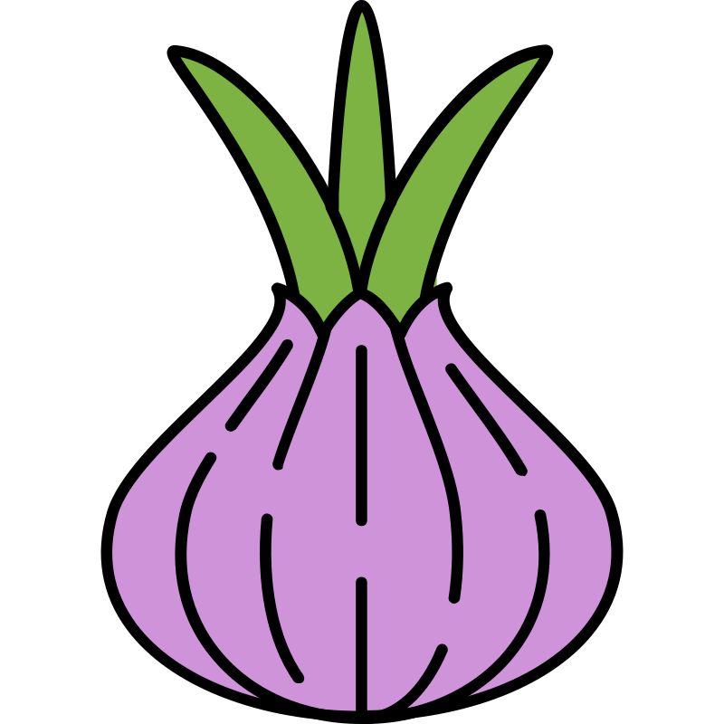

<p align="center">
  
</p>

<h1 align="center">peel</h1>

<p align="center">
  A browser-based container image inspector. Like <a href="https://github.com/wagoodman/dive">dive</a>, but visual.
</p>

---

```
┌─────────────────────────────────────────────────────┐
│  peel — image:tag                          metadata │
├──────────────┬──────────────────────────────────────┤
│              │                                      │
│   Layers     │         File Tree                    │
│              │                                      │
│   [layer 1]  │    ├── bin/                         │
│   [layer 2]  │    ├── etc/                         │
│   [layer 3]◄─│    │   └── nginx.conf [modified]    │
│              │    └── var/                         │
│              │                                      │
├──────────────┴──────────────────────────────────────┤
│                                                     │
│   File Content Viewer                               │
│   (syntax highlighted or hex)                       │
│                                                     │
└─────────────────────────────────────────────────────┘
```

## Features

- Layer-by-layer filesystem explorer with cumulative and diff views
- Syntax-highlighted file viewer for text, hex view for binaries
- Full keyboard navigation (arrow keys, vim bindings, tab between panels)
- Image metadata panel (ENV, ENTRYPOINT, CMD, labels, layer history)
- Whiteout/deletion tracking across layers
- Single static binary, no runtime dependencies

## Install

**Go install:**

```
go install github.com/coffee-cup/peel/cmd/peel@latest
```

**GitHub Releases:**

Pre-built binaries for macOS, Linux, and Windows are available on the [Releases](https://github.com/coffee-cup/peel/releases) page.

## Usage

```
peel <image-reference> [flags]
```

`<image-reference>` is a local image name/ID or remote registry reference (e.g. `myapp:latest`, `ghcr.io/org/repo:tag`).

**Flags:**

| Flag | Description |
|------|-------------|
| `--platform <os/arch>` | Target platform for multi-arch images (default: host) |
| `--no-open` | Don't auto-open browser |
| `--port <port>` | Port to listen on (default: 8080) |

## Build from source

```
mise run build
```

Builds the frontend, embeds it into the Go binary, and outputs `./peel`.
